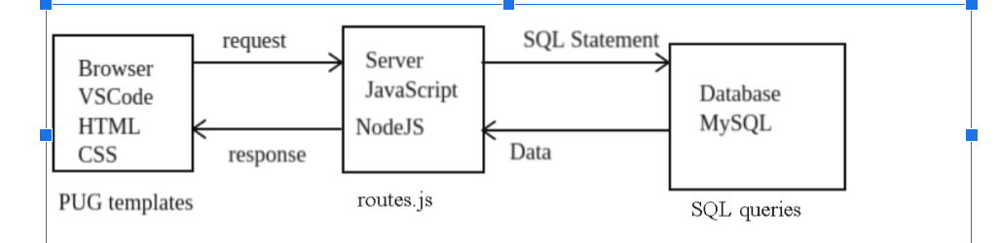
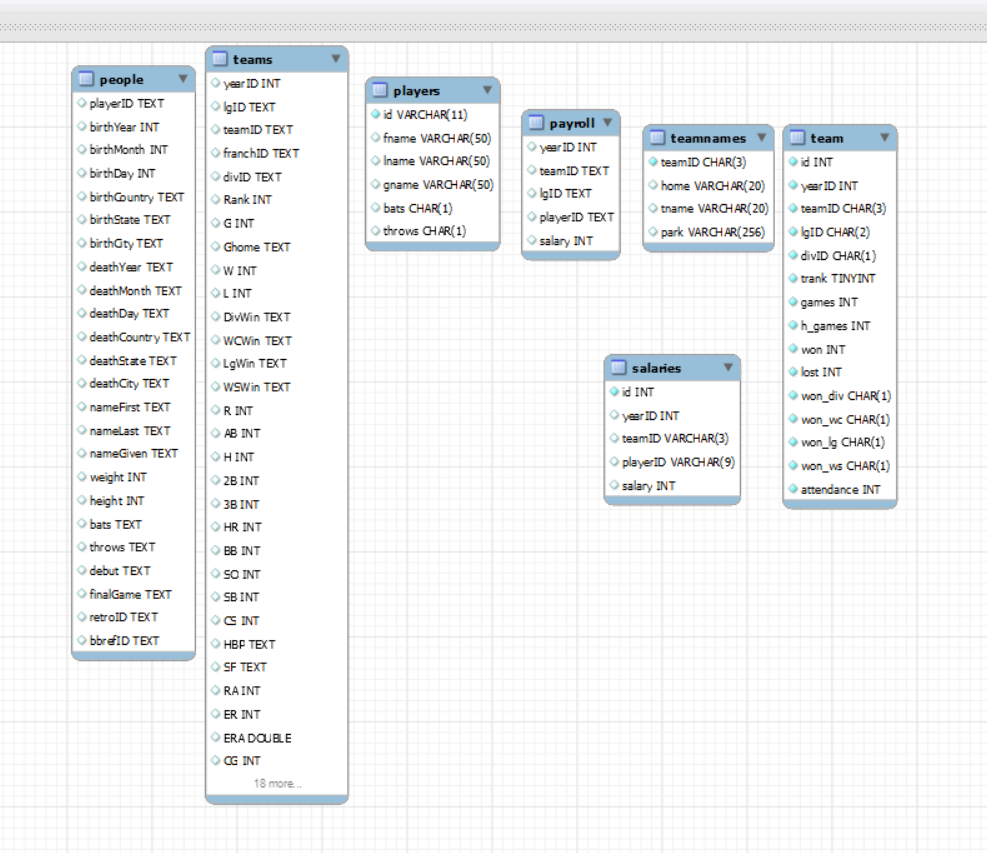
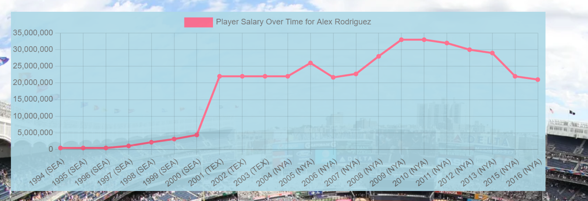

# My Capstone Project
## Architecture

Request starts in the browser and is sent to the server as where the response is sent from the server to the browser.
I used the http GET method for all of my routes.
I have two routes for each use case one for  the data table and one for graph

For example the average team salaries route first runs the query to get all the years from mySQL for which we have data (line 59 in routes.js) then it runs another query to get the total and average payroll for each team. (Which is in line 63)

The res.render in line 66 renders averageTeamSalariesPerYear pug file which is the HTML template.

The pug files create the HTML that is displayed in the browser. They use the data provided by the route. For example line 66 provides for pieces of data to the template.

Line 12 in the average team salaries per year.pug generates the year dropdown.

Line 22 through 24  based on the user’s click it will sort the data in ascending order and descending order.

Line 29 and 30 gives us the dollar sign and comma’s as currency.

Line 18 gives us the button for the graph

### Set up node.js javascript server
1. Downloaded installer for node.js and ran it
2. Went into vs code and opened a terminal
3. Initialized the node environment with npm init
4. Installed express js with npm install express. This is the web server
5. Installed mysql2 with npm install mysql2. This is the connector for mySQL
6. Installed pug with npm install pug. This is in HTML template generator.

## Steps for completing capstone project
1. Initialized database from using csv’s files from [Here](https://www.seanlahman.com/baseball-archive/statistics) 
2. For each use case I wrote between two and four SQL queries in mySQL WorkBench. Each use case has dropdowns and are populated by a SQL select statements and they also have select statements for the data . The data is similar for both the table and the graph in each use case. 
3. I connect to the database using lines 13 through 21 in routes.js file which happens in node.js
4.  I wrote a get route for each use case. Each followed the similar design
5. Receive all relevant query parameters, which are variable values that are passed on the url, such as the yearID or the sort column.
6. Get connection to the database all done in the routes.js file.
7. Execute the select statements to populate all dropdowns which is done in routes.js.
8. Execute the select statement to retrieve the data using values from query parameters. Which is done in routes.js.
9. Prepare json with the result 
10. Use the response object to render the HTML template and pass the json to it which happens in routes.js
11. Catch any errors, log them to the console and use the response object to send http error code 500 to the browser. This indicates that a server error occurred.
12. Finally end the SQL connection to close resources.

## User interface
1. I wrote HTML pug templates for each use case
2. I wrote a get route for graph each use case result using chart.js. These routes followed a similar design to step 3 above. Graph lines start at line 211  in route,js.
3. Wrote a HTML template to generate graph using chart js and the data provided by each of the graphing get routes. Which is done with graph.pug file.
4. Wrote menu HTML file which provides links to each of the use cases.

## Database
### Relational Data model (ERD)

1. How did I initialize the database?I imported the CSV files into the mySQL database using mySQL workbench.
2. How I sorted the tables? The SQL select statement has an order by clause to sort the data in either ascending or descending order.
3. How did I connect to the database using node.js? First I had to use npm to install mySQL2 node package. Second I used the code 13 through21 in routes.js which runs in node.js

